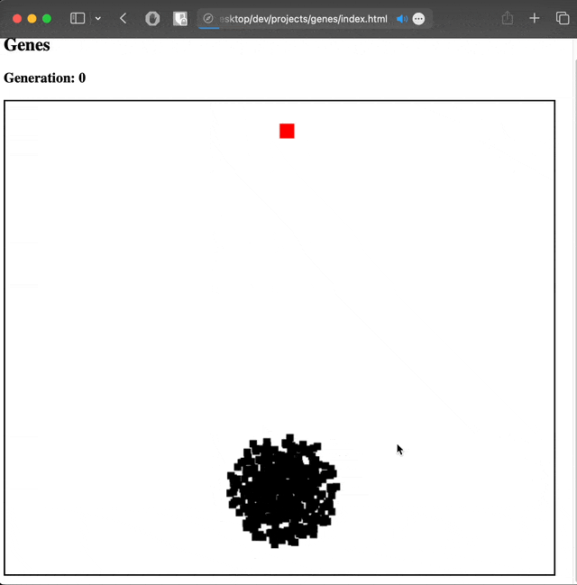

# SmartDots (Genetic Evolutionary Algorithm)

This is implementation of the genetic evolutionary which I tried to follow along with [CodeBullet's tutorial](https://www.youtube.com/watch?v=BOZfhUcNiqk) where he used processing to do the same. This is still a little buggy but works for the most part. 

## Demo

  

